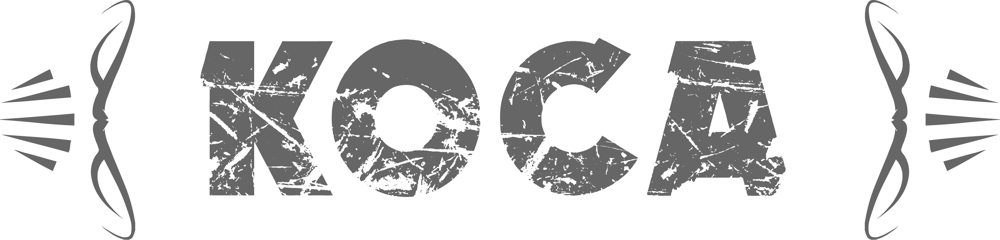

# 

> коса pronounced /koˈsa/ is a TypeScript implementation of the infamous board games Scythe designed by Jamey Stegmaier and published by Stonemaier Games. The main goal of this project is to provide the basis for developing an AI which is capable of competing against a human player.

## Getting started

```bash
git clone https://github.com/mihaeu/kosa-ts.git
npm install
npm test
```

## Server

```bash
cd game_server
npm start
```

## Client

*For manual testing only*

```bash
nc localhost 1337
```

### Commands

```
#######################
#   Kosa Game Server  #
#######################

Commands:
    WAITING
        List all games waiting for players
    RUNNING
        List all active games
    FINISHED
        List all finished games
    NEW
        Opens a new game
    JOIN <gameId> <faction> <playerMat>
        Join a game
    START <gameId>
        Starts a game
    ACTION <gameId> <playerId>
        List available action
    ACTION <gameId> <playerId> <action>
        List available options for an action
    OPTION <gameId> <playerId> <option>

Arguments:
    <gameId>        UUID v4 strings which you get after joining a game.
    <playerId>      UUID v4 strings which you get after joining the server.
    <faction>       one of the following: green black yellow white purple blue red
    <playerMat>     one of the following: engineering agricultural industrial mechanical patriotic innovative militant
    <action>        one of the following: trade move bolster produce
    <option>        JSON object which you get from the available actions command

```

## Rules

For Scythe rules please refer to the [official manual from Stonemaier Games](https://stonemaiergames.com/games/scythe/rules-and-print-play/).

## Implementation

### Event Sourcing

The implementation is completely event sourced i.e. no mutable state. All actions are tracked in an event log. Only valid actions can be placed on the event log. Game information is extracted by summing up information contained in the events.

Example: CointEvent(+3), CoinEvent(-2) => 1 coin available

Instead of representing the events in a list format we can instead map the different games in an event tree. This is a perfect match for the Monte-Carlo algorithm used for the AI.

### Map

The original game map consists of an hexagonal grid consisting of different field types. This however is not a suitable representation to compute possible moves. Instead we use a graph where each node has edges of various types representing the type of connection in the game (default, river, tunnel, ...).

```dot
white -> l1
red -> f3 [color=blue]
red -> v3
red -> m5
```

### Resources, Units, ...

Popularity, coins etc. are fairly easy to track. Resources on the other hand do not belong to any player in particular. Instead resources are bound to a specific location (moving resources is represented as removing them and adding them to another field).

Units are easy to track because the position is simply the last move, all previous moves are irrelevant. Legal moves are determined by filtering valid edges connected to the current node (field).
 
## Open Questions

 - [x] ~~how are top and bottom row actions matched together?~~
 - [ ] how do mechs move other units?
 - [ ] how do units move resources?
 - [ ] who validates the information? read request is easy and goes straight to game info, for write requests we have to first validate the request 

        example "red can always take the same action":
            valid action
                special: red -> top action multiple times
                others: last top action different or none?
                is bottom action -> last action of same user and matches top action?
                
        example "yellow can use resources for payment":

## Contributing

At this point in the project we do not look for other contributors, although this might change within the next couple of months.

## License

See [`LICENSE`](LICENSE) file.

## Contributors

In random order:

 - Jens Wohlgemuth
 - Helge Krueger
 - Andriy Samsonyuk
 - Michael Haeuslmann

 Developed with :heart: at [TNG](https://tngtech.com)
